# Hounds Hotels


Hounds Hotel is a business created to for dog owners to have a safe and homely space for their furry family members to stay whilst they go away.

The main objective of the site is to provide the user with information on the services provided and enable them to make a booking.

Visit the deployed website [here](https://hounds-hotel.herokuapp.com/)


## Table of Contents

1. [User Experience (UX)](#user-experience-ux)
    1. [Strategy](#strategy)
        1. [Project Goals](#project-goals)
        2. [User Goals](#user-goals)
        3. [Strategy Table](#strategy-table)
    2. [Scope](#scope)
        1. [User Stories](#user-stories)
    3. [Structure](#structure)
        1. [Database Model](#database-model)
    4. [Skeleton](#skeleton)
        1. [Wireframes](#wireframes)
    5. [Surface](#surface)
        1. [Color Scheme](#color-scheme)
        2. [Typography](#typography)
2. [Features](#features)
    1. [General](#general)
    2. [Home Page](#home-page)
    3. [About Page](#about-page)
    12. [Authentication Pages](#authentication-pages)
3. [Technologies Used](#technologies-used)
    1. [Languages Used](#languages-used)
    2. [Libraries and Frameworks](#languages-and-frameworks)
    3. [Packages / Dependecies Installed](#packages--dependecies-installed)
    4. [Database Management](#database-management)
    5. [Tools and Programs](#tools-and-programs)
4. [Testing](#testing)
    1. [HTML]
    2. [CSS]
    3. [PYTHON]
    4. [JAVASCRIPT]
    5. 
5. [Deployment](#deployment)
    1. [How To Use This Project](#how-to-use-this-project)  
    2. [Deployment to Heroku](#deployment-to-heroku)  
6. [Finished Product](#finished-product)
7. [Credits](#credits)
8. [Known Bugs](#known-bugs)
9. [Acknowledgements](#acknowledgements)


***


## User Experience (UX)

### Strategy

#### Project Goals

* The website contains simple colors for a modern design and also to not draw attention from the content.

* Responsive design to make the website accessible on different screen sizes.

* Structure is easy to understand and navigates effortlessly.

* Site user are able to sign up & sign in 

* Site users can edit there personal info, but must contact admin to change there user name or email address.

* Site users are able to fill out a form and make a booking request.


#### User Goals

**Epic 1 - Admin Experience**

* As a Site Admin,  I want to view all user accounts.

* As a Site Admin,  I want to edit and delete all user accounts. 

* As a Site Admin,  I want to designate staff accounts to staff members.

* As a Site Admin,  I want to manage the appointment times.


**Epic 2 - User Experience**

* As a Site User, I want to be able to create a account.

* As a Site User, I want to be able to edit my personal account information.

* As a Site User, I want to be able to make a booking request.

* As a Site User, I want to be able find the company contact information and social media.

* As a Site User, I want the information to be easy to find and read.


**Epic 3 - Customer Experience**

* As a Customer, i want to know what services are available.

* As a Customer, i want to meet the staff and understand the experience they have.

* As a Customer, i want to read previous customer reviews.

* As a Customer, i want to send a quick message through a contact form.

#### Strategy Table

Opportunity / Problem | Importance | Viability / Feasibility
--- | --- | ---
Responsive design | 5 | 5
Account Sign up | 5 | 5
Edit User profile | 5 | 5
Make a booking | 5 | 5
Contact form | 5 | 5
Social media links | 5 | 5
Admin Manage bookings & edit accounts| 4 | 4
Staff pictures and bio| 4 | 4
Customer Reviews| 4 | 4
Booking automatic confirmation| 3 | 4
Multiple Payment options| 4 | 3
Newsletter sign-up| 3 | 3 
3d Renderings of the facilitys| 3 | 3 
Loyalty Scheme| 3 | 4 
**Total** | **58** | **59**


### Scope

According to the strategy table, not all features can be implemented in the first release of the project. For this reason, the project will be divided in multiple phases. The first phase will include the features that have been identified in order to build the minimum viable product.


**First Phase**

* Responsive design

* Create, edit and delete accounts

* Account registration.

* Make a booking request.

* Edit User profiles.

* Social media links. 

* Contact form. 

* Reviews section carosel.

**Second Phase**

* Booking will be automatically confirmed.

* Rtes for rooms and additional services will be shown.

* Card payments will be accepted for bookings.

* Sign up for newsletter.


**Third Phase**

*  3d renderings of the grounds, rooms and facilitys.

*  Additional payment options.

*  Loyalty scheme.

#### User Stories

GitHub projects was used as my project management tool to track user stories. Using a Kanban board helped to focus on specific tasks and track the project progress.

**Start**
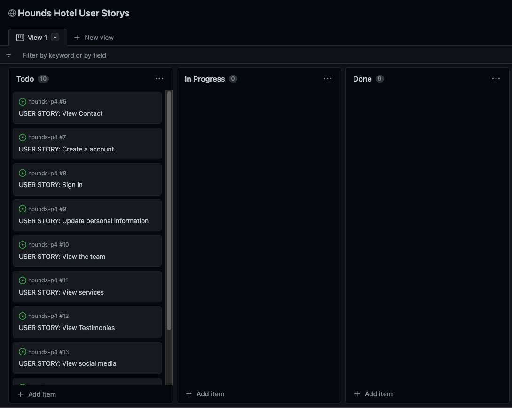

**Progress 1**
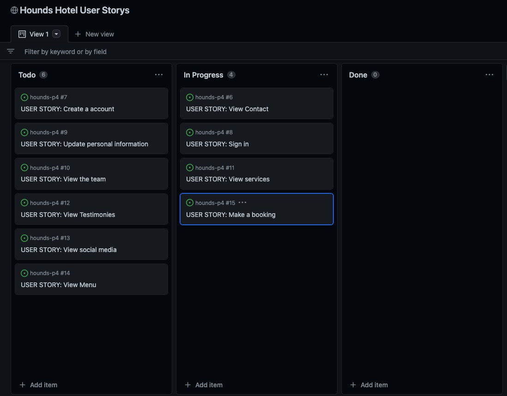

**Progress 2**
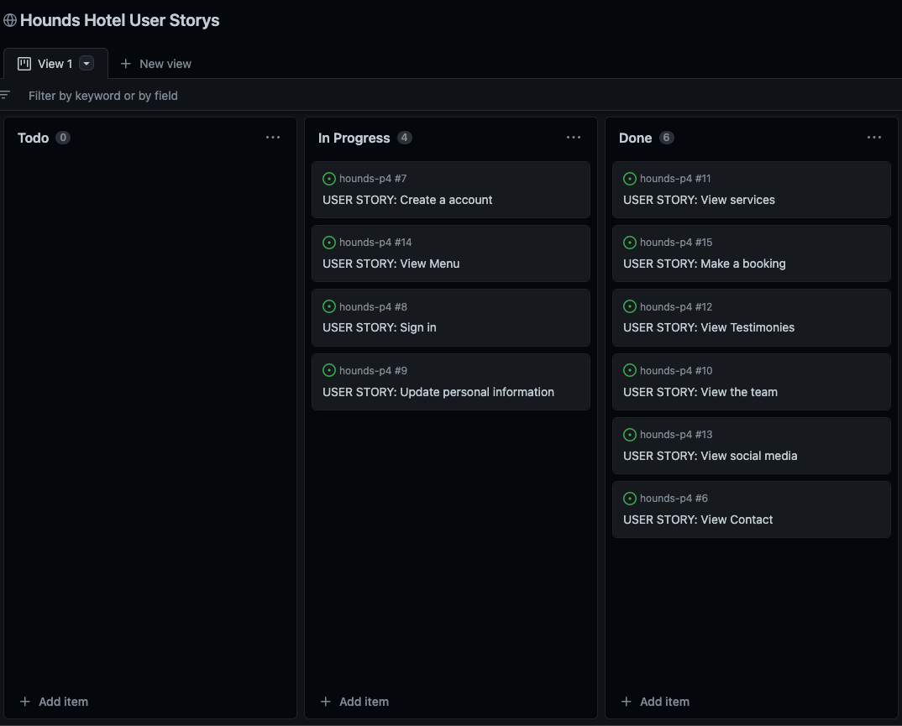

**Progress 3**
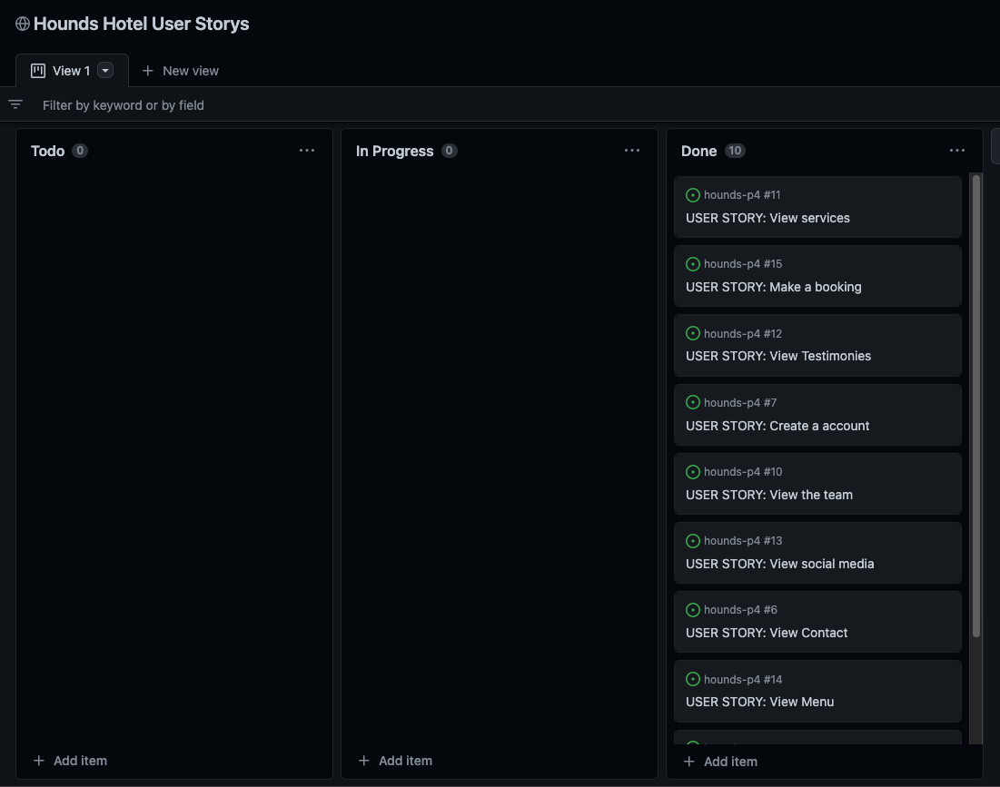


## Structure

The website has been organized in a Hierarchical Tree Structure to ensure the site user navigates through the site effortlessly and intuitively. 

* Header and navigation bar are consistent through all pages.

* Links and forms provide clear feedback to the site user.

* New additional features are provided for the user once they register an account, such as make a booking.


#### Database Model

The database model has been designed using [drawsql](https://drawsql.app/). The type of database being used for the is relational database being managed using SQLite3 during development and deployed using [PostgreSQL](https://www.postgresql.org/).

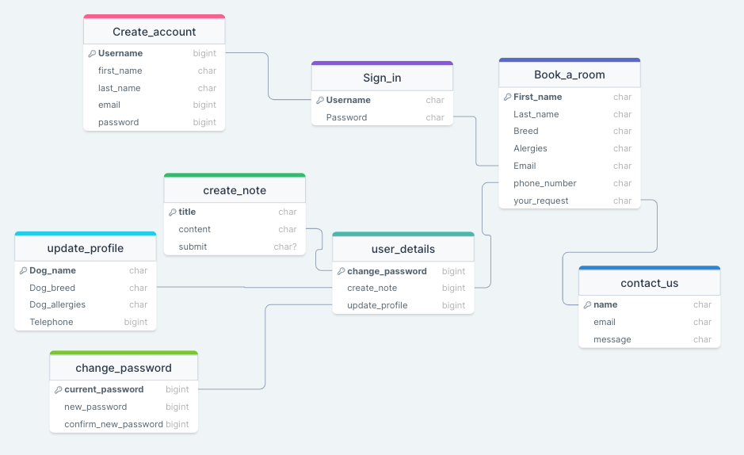


### Skeleton

#### Wireframes

[Balsamiq](https://balsamiq.com/) has been used to showcase the appearance of the site and display the placement of the different elements in the pages.

Page | Desktop Version | Mobile Version
--- | --- | ---
Home Page |  | 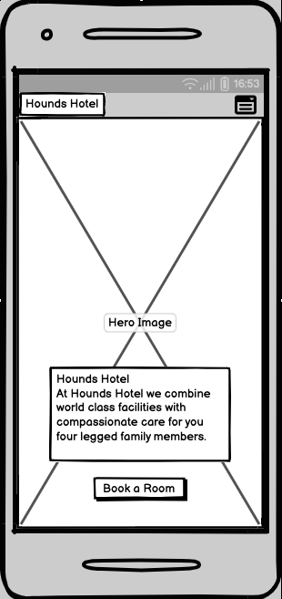
Our Team |  | 
Services| 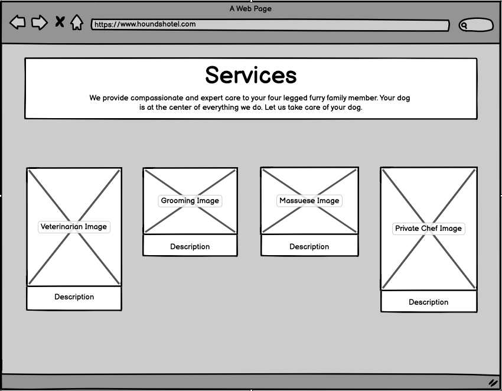 | 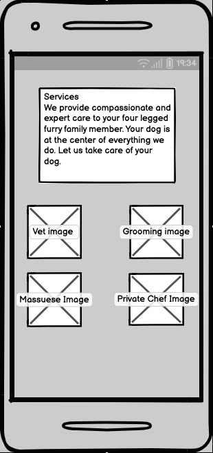
Testimonies |  | 
Contact Us |  | 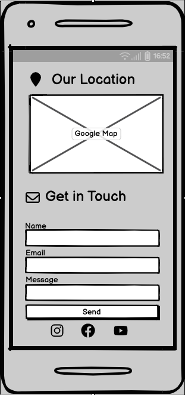


### Surface

#### Color Scheme


The colors used in the website are  Ecru (#B49E5C) for Service banner, send email button, social media icons & in the Booking form.   Silver Chalice (#AAAAAA) & Black (#000000) are  used for the main text, with White (#FFFFFF) asthe background

The colors are were chosen keeping in mind simplicity but also providing the website a modern design. This in order to keep the focus on the content but also appealing for the users.

#### Typography

The main font being used in the site is Source Sans Pro , with sans-serif as a fallback in case Source Sans Pro doesn't get imported correctly. 

Source Sans Pro  was chosen after some research on fonts that are better for reading. 

[Back to top ⇧](#hounds-hotel)


## Features

### General

* The website has been designed from a mobile first perspective.

* Responsive design across all device sizes.

* Navigation Bar


    *  Contains the main logo and section links.

    * The navigation bar contains links to all sections to facilitate navigation across the site. It also has a hover effect that changes color to provide feedback to the Site User for a better user experience.


* Social Media Links
  

    * The Contact Us section contain icons with embedded links to the social media sites


### Home Page


### Our Team


* Provide images, names & titles of our team.


### Services 


* Display information about the Services on offer.

* Display images and short description.


### Testimonial


* A image carosel

* 3 images of clients

* with a breif review and there name

### Contact Us


* Here is the business address, google map, social media links & send email form.

### Manage
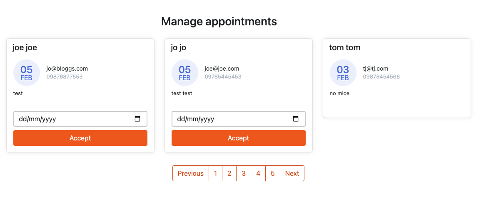

* Allows the site admin to accept the booking


### Authentication Pages


[Back to top ⇧](#hounds-hotel)


## Technologies Used

### Languages Used

* [HTML5](https://en.wikipedia.org/wiki/HTML)
* [CSS3](https://en.wikipedia.org/wiki/CSS)
* [JavaScript](https://en.wikipedia.org/wiki/JavaScript)
* [Python](https://en.wikipedia.org/wiki/Python_(programming_language))


### Libraries and Frameworks

* [Django](https://www.djangoproject.com/)   
    * Django was used as web framework.

* [Django Template](https://jinja.palletsprojects.com)  
    * Django Template was used as a templating language for Django to display backend data to HTML.
   
* [Bootstrap 5](https://getbootstrap.com/docs/5.0/getting-started/introduction/)  
    * Bootstrap 5 was used throughout the website to help with styling and responsiveness.

* [Google Fonts](https://fonts.google.com)  
    * Google fonts was used to import the fonts into the html file, and were used on all parts of the site.

* [Font Awesome](https://fontawesome.com)  
    * Font Awesome was used throughout the website to add icons for aesthetic and UX purposes. 

* [jQuery 3.6.0](https://jquery.com/)  
    * jQuery was used as a JavaScript library to help writing less JavaScript code.  


### Packages / Dependecies Installed

* [Django Allauth](https://django-allauth.readthedocs.io/en/latest/)  
    * Django Allauth was used for user authentication, registration, and account management.

* [Django Crispy Form](https://django-crispy-forms.readthedocs.io/en/latest/)   
    * Django Crispy Form was used to control the rendering of the forms. 
 
* [Gunicorn](https://gunicorn.org/)  
    * Gunicorn was used as Python WSGI HTTP Server for UNIX to support the deployment of Django application.  


* [Cloudinary](https://cloudinary.com/)
    * Cloudinary has been used as image management solution

### Database Management
* [Heroku Postgres](https://www.heroku.com/postgres)   
    * Heroku Postgres database was used in production, as a service based on PostgreSQL provided by Heroku.


### Tools and Programs

* [Git](https://git-scm.com)  
    * Git was used for version control by utilizing the Gitpod terminal to commit to Git and Push to GitHub. 

* [GitPod](https://gitpod.io/)
     * GitPod was used for writing code, committing, and then pushing to GitHub.

* [GitHub](https://github.com)  
   GitHub was used to store the projects code after being pushed from Git. 

* [Heroku](https://www.heroku.com)   
    * Heroku was used to deploy the website.

* [Tiny PNG](https://tinypng.com)    
    * Tiny PNG was used to reduce the file size of the images.

* [Coolors](https://coolors.co)  
    * Coolors was used to create a color scheme for the website.

* [Balsamiq](https://balsamiq.com/)
     * Balsamiq was used to create the wireframes during the design phase of the project

* [Chrome DevTools](https://developer.chrome.com/docs/devtools/)
    * Chrome DevTools was used during development process for code review and to test responsiveness.

* [W3C Markup Validator](https://validator.w3.org/)
    * W3C Markup Validator was used to validate the HTML code.

* [W3C CSS Validator](https://jigsaw.w3.org/css-validator/)
    * W3C CSS Validator was used to validate the CSS code.

* [JSHint](https://jshint.com/) 
    * The JSHints JavaScript Code Quality Tool was used to validate the site's JavaScript code.

* [Favicon.io](https://favicon.io) was used to create the site favicon.


[Back to top ⇧](#hounds)


## Testing

HTML 

The testing was performed using (https://validator.w3.org/nu/) for the HTML.

Numerous errors were returned when passing through the official W3C validator

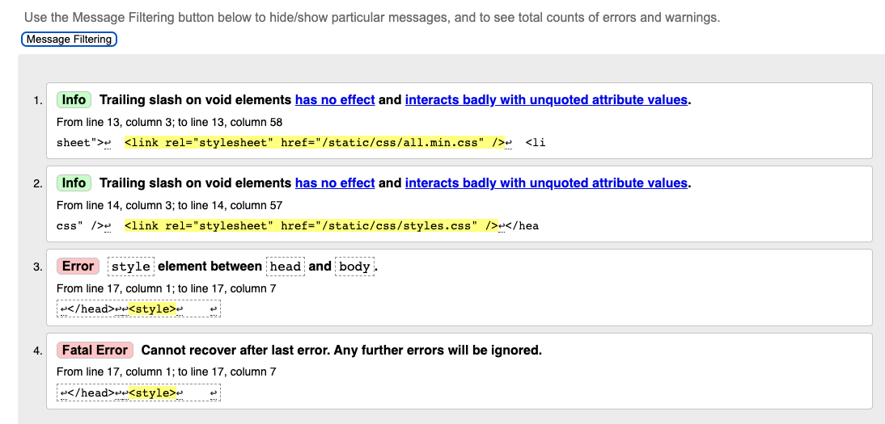 |

Once those where cleared a new set of errors appeared.

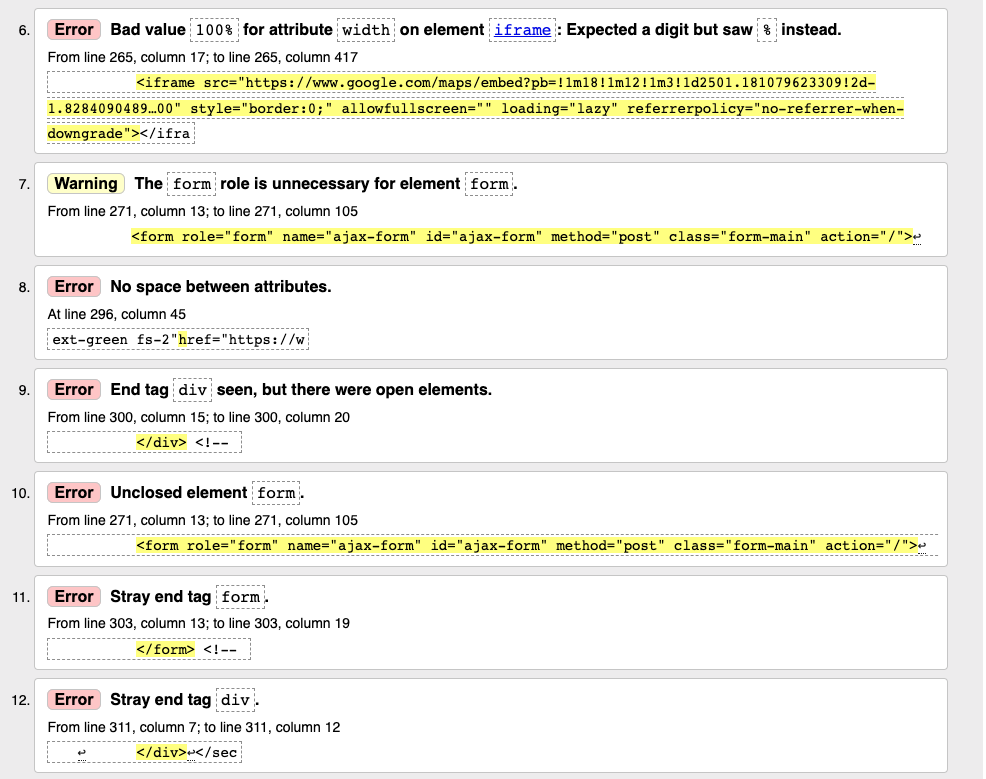 |


And after fixing errors, just a few warnings remain.

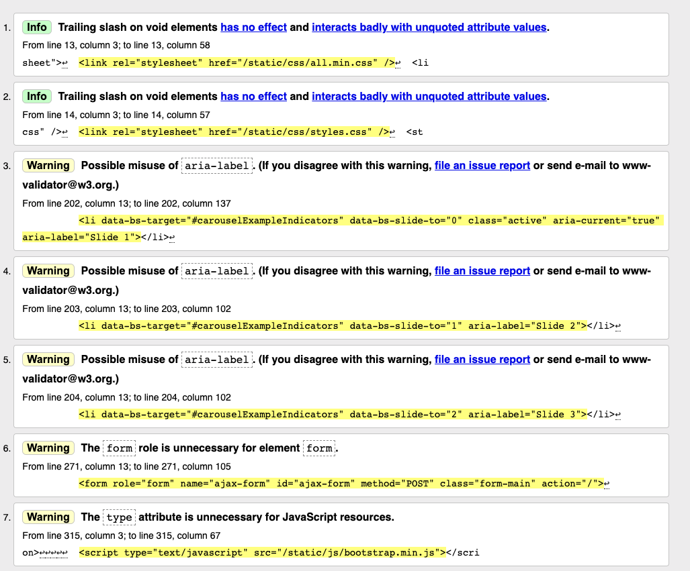 |


CSS

The testing was performed using (https://jigsaw.w3.org/css-validator/) for the CSS.

No errors were returned when passing through the official W3C validator

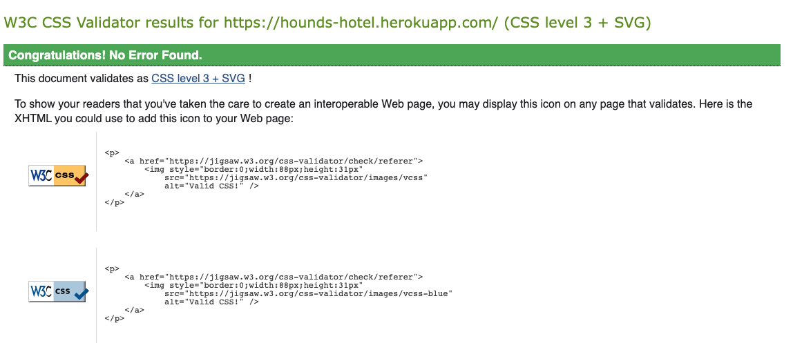 |


PYTHON


The testing was performed using (https://pep8ci.herokuapp.com/) for the PYTHON.

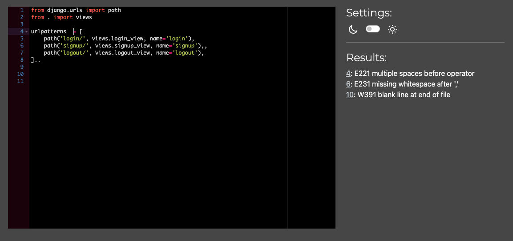 |

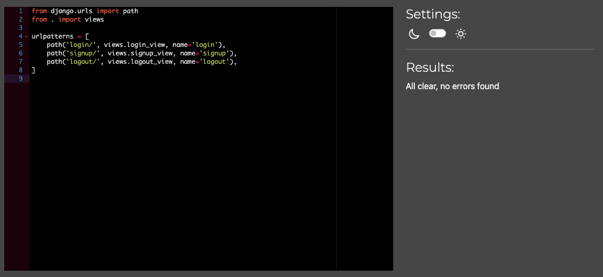 |


[Back to top ⇧](#hounds)

## Deployment
 
The project was developed using[GitPod](https://gitpod.io/) workspace. The code was commited to [Git](https://git-scm.com/) and pushed to [GitHub](https://github.com/") using the terminal. The web application is deployed on Heroku as Github Pages is not able to host a Python project.  The repository is hosted on Github.


### How To Use This Project
To use and further develop this project you can either fork or clone the repository.  


#### Fork GitHub Repository
By forking the GitHub repository you can make a copy of the original repository on your GitHub account to view and/or make changes without affecting the original repository, by using the following steps:  

1. Log in to GitHub.  
2. Navigate to the main page of the GitHub Repository that you want to fork.  
3. At the top right of the Repository just below your profile picture, locate the "Fork" button.  
4. You should now have a copy of the original repository in your GitHub account.  
5. Changes made to the forked repository can be merged with the original repository via a pull request.  


#### Clone Github Repository
By cloning a GitHub repository you can create a local copy on your computer of the remote repository. The developer who clones a repository can synchronize their copy of the codebase with any updates made by fellow developers with push or pull request. Cloning is done by using the following steps:  

1. Log in to GitHub.  
2. Navigate to the main page of the GitHub Repository that you want to clone.  
3. Above the list of files, click the dropdown called "Code".  
4. To clone the repository using HTTPS, under "HTTPS", copy the link.  
5. Open Git Bash.  
6. Change the current working directory to the location where you want the cloned directory to be made.  
7. Type git clone, and then paste the URL you copied in Step 4.  
```$ git clone https://github.com/YOUR-USERNAME/YOUR-REPOSITORY```
8. Press Enter. Your local clone will be created.   
```
$ git clone https://github.com/YOUR-USERNAME/YOUR-REPOSITORY
> Cloning into `CI-Clone`...
> remote: Counting objects: 10, done.
> remote: Compressing objects: 100% (8/8), done.
> remove: Total 10 (delta 1), reused 10 (delta 1)
> Unpacking objects: 100% (10/10), done.
```  
Changes made on the local machine (cloned repository) can be pushed to the upstream repository directly if you have a write access for the repository. Otherwise, the changes made in the cloned repository are first pushed to the forked repository, and then a pull request is created.  


#### Project Set Up After Forking or Cloning  
1. Install all dependencies by typing in the CLI ```pip3 install -r requirements.txt```  
2. Create a ```.gitignore``` file and ```env.py``` file in the project's root directory. Add the ```env.py``` file to ```.gitignore```. 
3. Inside the env.py file, enter the project's environment variables:   
   ```
   import os

   os.environ.setdefault("SECRET_KEY", <your_secret_key>)
   os.environ.setdefault("DEVELOPMENT", '1')
   os.environ.setdefault("STRIPE_PUBLIC_KEY", <your_key>)
   os.environ.setdefault("STRIPE_SECRET_KEY", <your_key>)
   os.environ.setdefault("STRIPE_WH_SECRET", <your_key>)
   ```   
   You can get the keys from:
   - "SECRET_KEY" can be generated using [Django Secret Key Generator](https://miniwebtool.com/django-secret-key-generator/)   
   - "STRIPE_PUBLIC_KEY" and "STRIPE_SECRET_KEY" can be generated by creating a stripe account. The keys are found in 'Developers' Section, under 'API Keys'.  
   - In the Developer Section, under 'Webhooks', add a new endpoint.  "STRIPE_WH_SECRET". On Endpoint URL, enter:  
   ``` https://<your_host_url>/checkout/wh/ ```   
   Select to listen to all events, and create endpoint, and you can view your "STRIPE_WH_SECRET".   

4. Make migrations to setup the inital database operations.  
   ``` 
   python3 manage.py makemigrations 
   python3 manage.py migrate 
   ```   
5. Load data for the database or create data manually. 
   ```
   python3 manage.py loaddata <app_name>
   ``` 
6. Create a super user.
   ```
   python3 manage.py create superuser
   ```  
The project should now complete to run and can now be used for development. To run the project, type in the CLI terminal: ```python3 manage.py runserver```     


### Deployment to Heroku 
This project is deployed on Heroku for production, with all static and media files stored on AWS S3. These are steps to deploy on Heroku:

1. Navigate to Heroku.com, create a new account or login if you already have an account. On the dashboard page, click "Create New App" button. Give the app a name, the name must be unique with hypens between words. Set the region closest to you, and click "Create App".   
2. On the resources tab, provision a new Heroku Postgres database.  
3. Configure variables on Heroku by navigating to Settings, and click on Reveal Config Vars. You may not have all the values yet. Add the others as you progress through the steps.   
   Varables | Key   
   ---| ---   
   AWS_ACCESS_KEY_ID | your_access_key_id_from_AWS   
   AWS_SECRET_ACCESS_KEY | your_secret_access_key_from_AWS  
   DATABASE_URL | your_database_url   
   EMAIL_HOST_PASS | your_app_password_from_your_email   
   EMAIL_HOST_USER | your_email_address  
   SECRET_KEY | your_secret_key 
   STRIPE_PUBLIC_KEY | your_stripe_public_key  
   STRIPE_SECRET_KEY | your_stripe_secret_key  
   USE_AWS | True 

4. If you haven't install it, install dj_database_url and psycopg2.
   ```
   pip3 install dj_database_url
   pip3 install psycopg2-binary
   ```
   Note: you don't have to do this if you've installed all dependencies in the requirements.txt file.  
5. Set up a new database for the site by going to the project's settings.py and importing dj_database_url. Comment out the database's default configuration, and replace the default database with a call to dj_database_url.parse and pass it the database URL from Heroku (you can get it from your config variables in your app setting tab)
   ```
   DATABASES = {
     'default': dj_database_url.parse('YOUR_DATABASE_URL_FROM_HEROKU')
   }
   ```
6. Run migrations
   ```
   python3 manage.py migrate
   ```  
7. Import data to the database.
    - Make sure your manage.py file is connected to your sqlite3 database.
    - Use this command to backup your current database and load it into a db.json file:
    ```
    ./manage.py dumpdata --exclude auth.permission --exclude contenttypes > db.json
    ```
    - Connect your manage.py file to your postgres database
    - Then use this command to load your data from the db.json file into postgres:
    ``` 
    ./manage.py loaddata db.json
    ``` 
8. Set up a new superuser, fill out the username, email address, and password.
   ```
   python3 manage.py create superuser
   ```  
9. Remove the database config from Heroku and uncomment the original config. Add a conditional statement to define that when the app is running on Heroku. we connect to Postgres, and otherwise, we connect to Sqlite.   
   ```
   if 'DATABASE_URL' in os.environ:
      DATABASES = {
         'default': dj_database_url.parse(os.environ.get('DATABASE_URL'))
      }
   else:
      DATABASES = {
         'default': {
            'ENGINE': 'django.db.backends.sqlite3',
            'NAME': BASE_DIR / 'db.sqlite3',
         }
      }
   ```  
10. Install gunicorn which will act as the webserver, and put it on the requirements.txt.   
   ``` 
   pip3 install gunicorn
   pip3 freeze > requirements.txt
   ```
   Note: you don't have to do this if you've installed all dependencies in the requirements.txt file.
11. Create a Procfile, to tell Heroku to create a web dyno, which will run unicorn and serve the Django app.   

   Inside the Procfile:
   ```
   web: gunicorn shoes_and_more.wsgi:application
   ```
12. Login to Heroku through CLI, using ```heroku login```. Once logged in, disable the collect static temporarily, so that Heroku won't try to collect static files when it deploys.
   ```
   heroku config:set DISABLE_COLLECTSTATIC=1 --app shoes-and-more
   ```
   And add the hostname of the Heroku app to allowed hosts in the project's settings.py, and also add localhost so that Gitpod will still work as well:  
   ```
   ALLOWED_HOSTS = ['hound-hotel.herokuapp.com', 'localhost']
   ```   
13. Add, commit, and push to gitpod and then to Heroku. After pushing to gitpod as usual, initialize git remote first:
   ```
   heroku git:remote -a hounds-hotel
   ``` 
   Then push to Heroku:
   ```
   git push heroku main
   ```
14. Go to the app's dashboard on Heroku and go to Deploy. Connect the app to Github by clicking Github and search for the repository. Click connect. Also enable the automatic deploy by clicking Enable Automatic Deploys, so that everytime we push to github, the code will automatically be deployed to Heroku as well.  
15. Go back to settings.py and replace the secret key setting with the call to get it from the environment, and use empty string as a default. 
   ```
   SECRET_KEY = os.environ.get('SECRET_KEY', '')
   ```
   Set debug to be true only if there's a variable called development in the environment.
   ```
   DEBUG = 'DEVELOPMENT' in os.environ
   ```
  
## Finished Product

Page | Desktop | Mobile |
--- | --- | --- |
| Home | 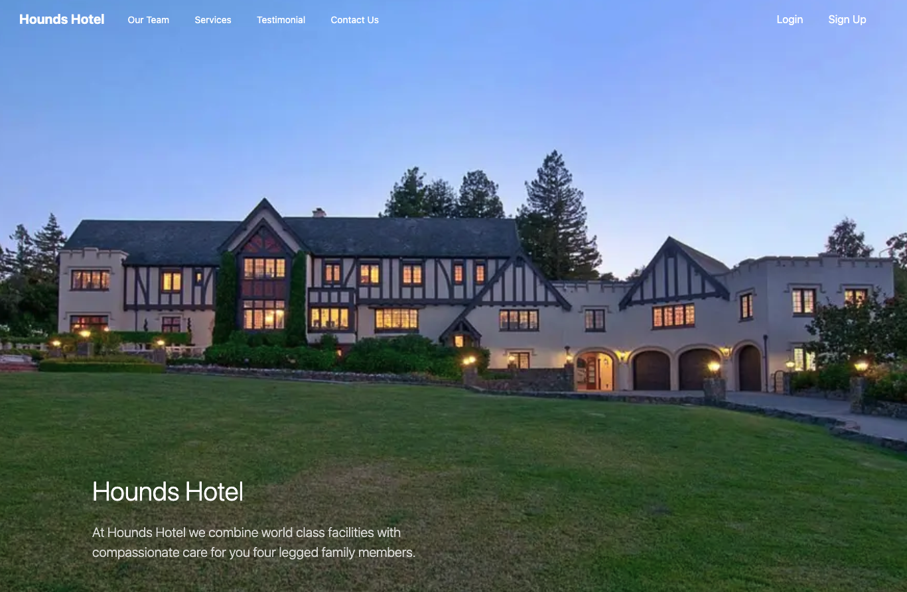 | 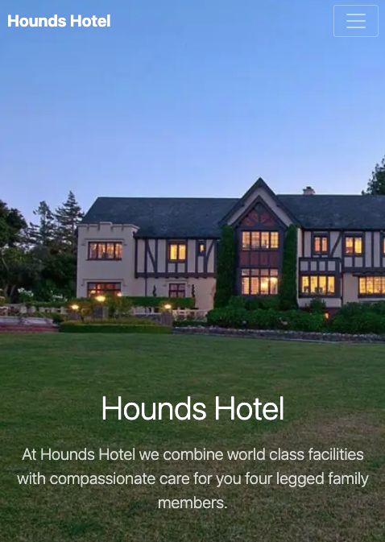 |
| Sign-up | 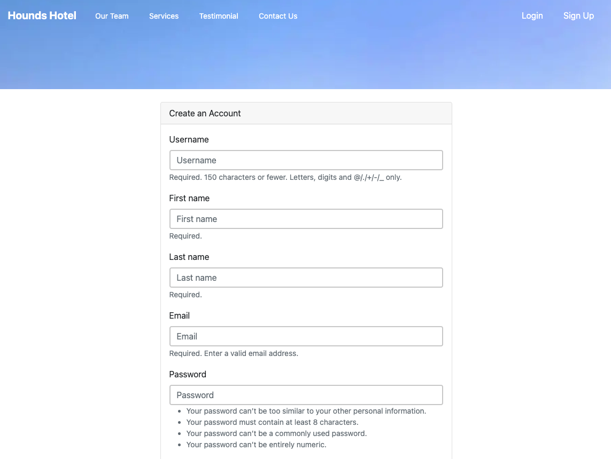 | 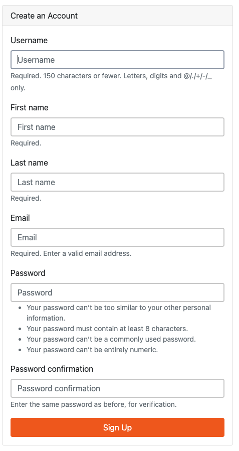 |
| Make-booking | 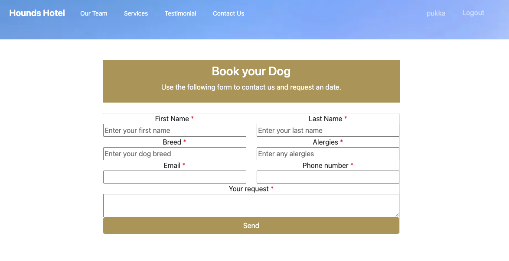 | 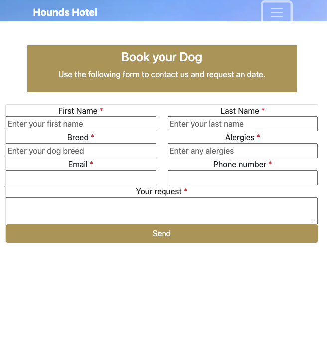 |
| Profile | 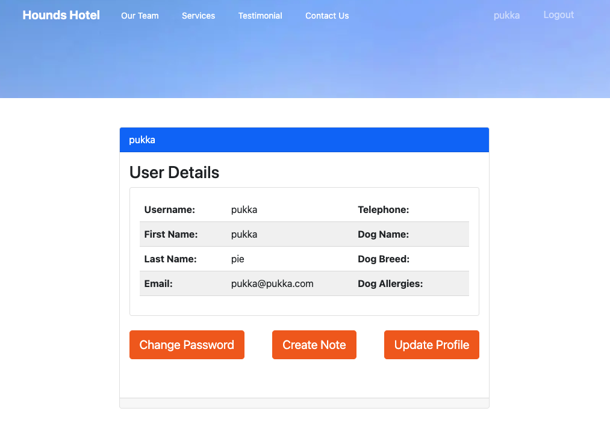 | 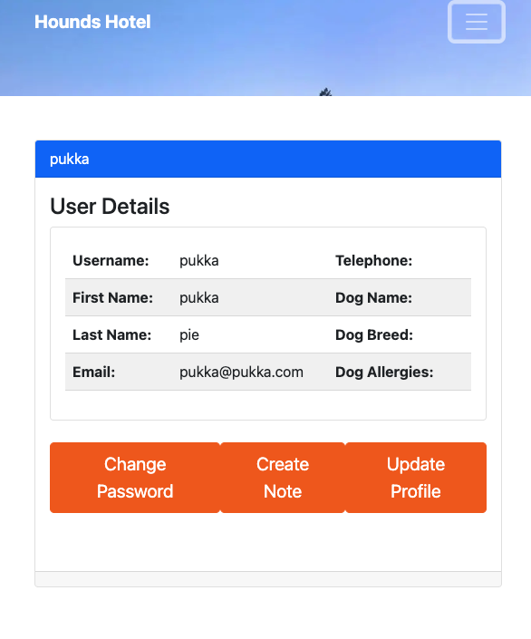 |
| Staff| 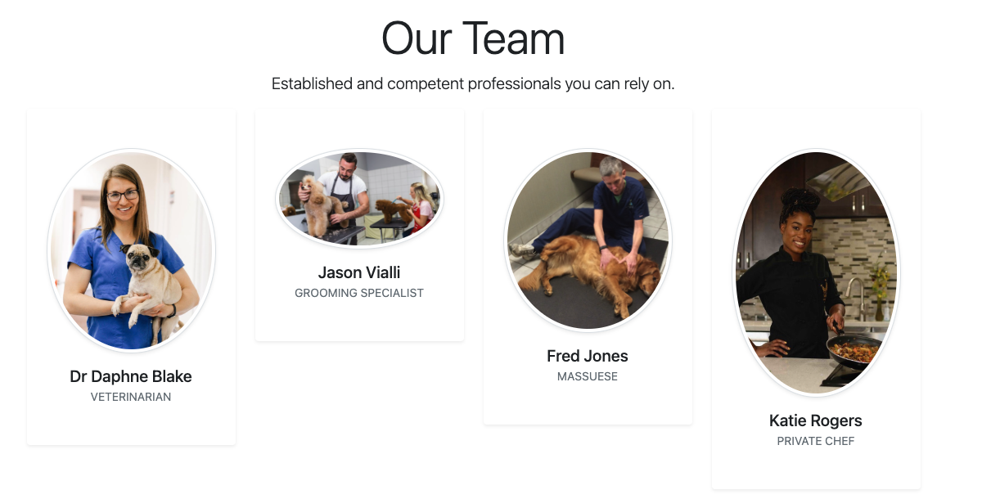 | 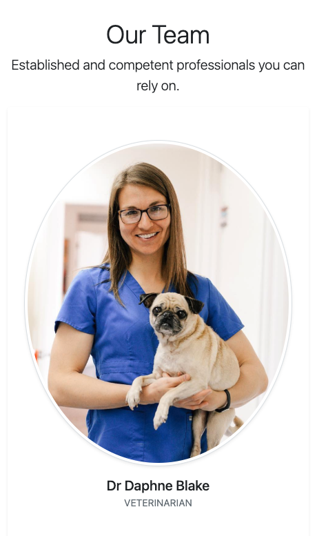 |
| Reviews | 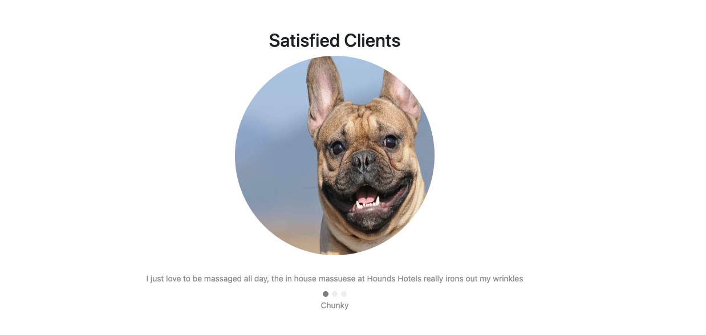 | 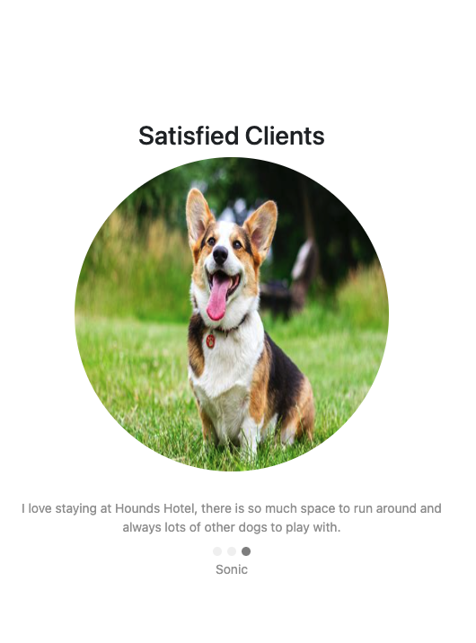 |
| Contact form | 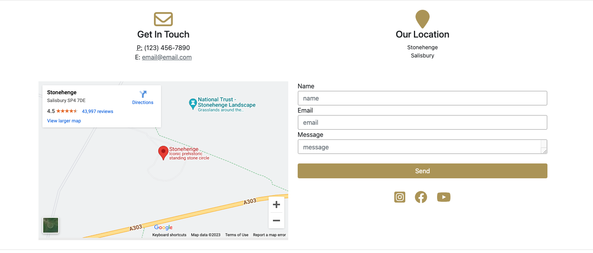 | 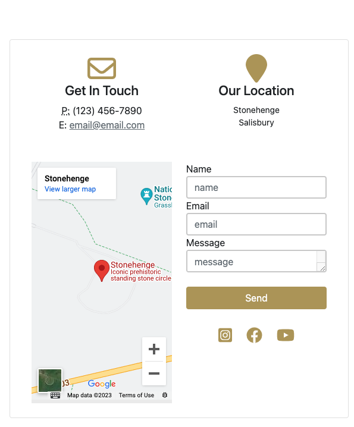 |


## Credits


### Content


* All other content was written by the developer.


### Media


### Code

* The code in Code Institute's video on the Boutique Ado project was used as the main reference point to set up an e-commerce / online store project using HTML, CSS, JS, Python+Django, PostgreSQL database.


## Known Bugs

**Hamburger mobile version menu on booking page**

* The menu options are not legible due to font colour and positioning


**Responsiveness in product quantity form on shopping bag**


[Back to top ⇧](#hounds)

## Acknowledgements


* My tutor, Marcel, for his invaluable support, feedback and guidance through the whole process.

* Code Institute and it's amazing Slack community for their support and providing me with the necessary knowledge to complete this project.

[Back to top ⇧](#hounds)


